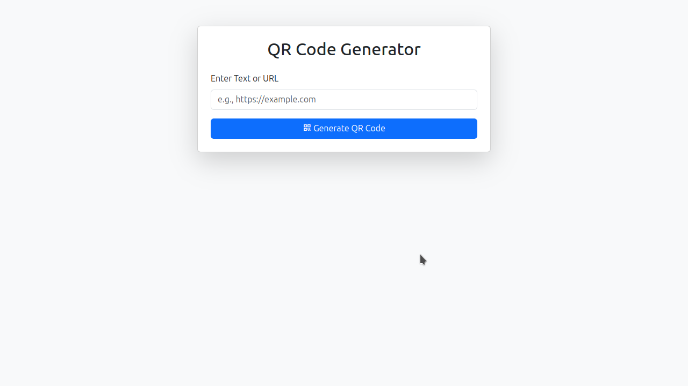
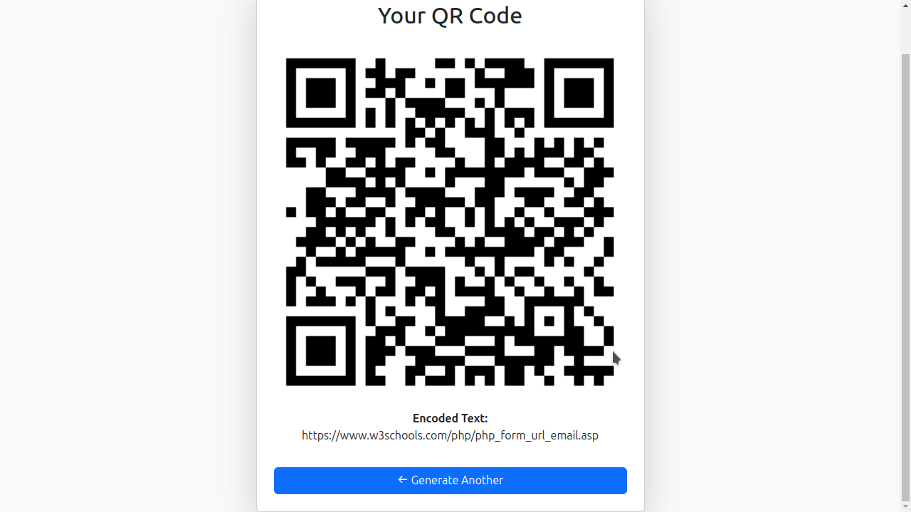

# QR Code Generator

This is a simple PHP-based QR code generator that allows users to input text or URLs and generate QR codes. The generated QR code can be downloaded and shared on social media platforms like Facebook, Twitter, WhatsApp, and Telegram.

## Features
- Generate QR codes from text or URLs.
- Download the QR code as an image.
- Share QR codes on social media platforms.
- User-friendly interface with Bootstrap styling.

## Installation
1. Clone the repository or download the files.
2. Ensure you have **Composer** installed.
3. Run the following command to install dependencies:
   ```sh
   composer install
   ```
4. Start a local server:
   ```sh
   sudo /opt/lampp/lampp start
    ```
or use
```sh
   php -S localhost:8000
   ```
   I use XAMPP On a Linux MInt PC, this can also work on a WIndows /MacOS Based system that process is the same, just start the server and then visit the address
5. Open `http://localhost:8000` in your browser.

## Usage
1. Enter text or a URL in the input field.
2. Click the "Generate QR Code" button.
3. Download or share the QR code as needed.

## Dependencies
- **PHP** (>=7.4 recommended)
- **Composer**
- **Endroid QR Code Library**
- **Bootstrap** for UI styling
- **Boxicons** for icons


Usage

Enter text or a URL in the input field.

Select customization options:

Size: 100px - 500px

Foreground Color: Choose any color for the QR code.

Background Color: Set the background color.

Error Correction Level: L, M, Q, H (Higher levels make the QR code more resilient to errors but increase size).

Click the "Generate QR Code" button.

Download or share the QR code as needed.

## Screenshots





## Contributing

Feel free to contribute to this project by submitting pull requests or opening issues.

## License

This project is licensed under the MIT License.
## Future Enhancements
- Convert to a Laravel-based project.
- Add more customization options (color, size, error correction levels).
- Store generated QR codes for later access.

## License
This project is open-source and free to use.

